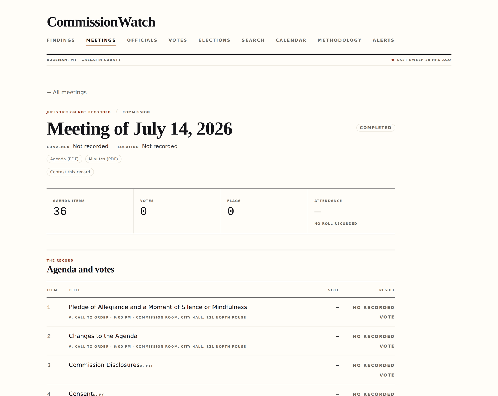
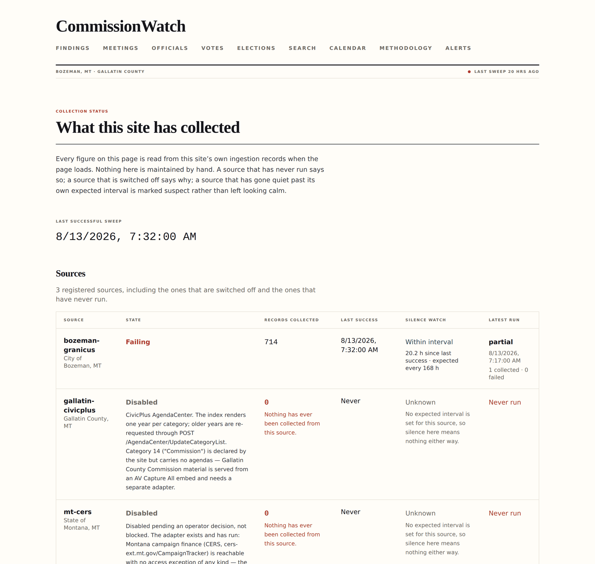
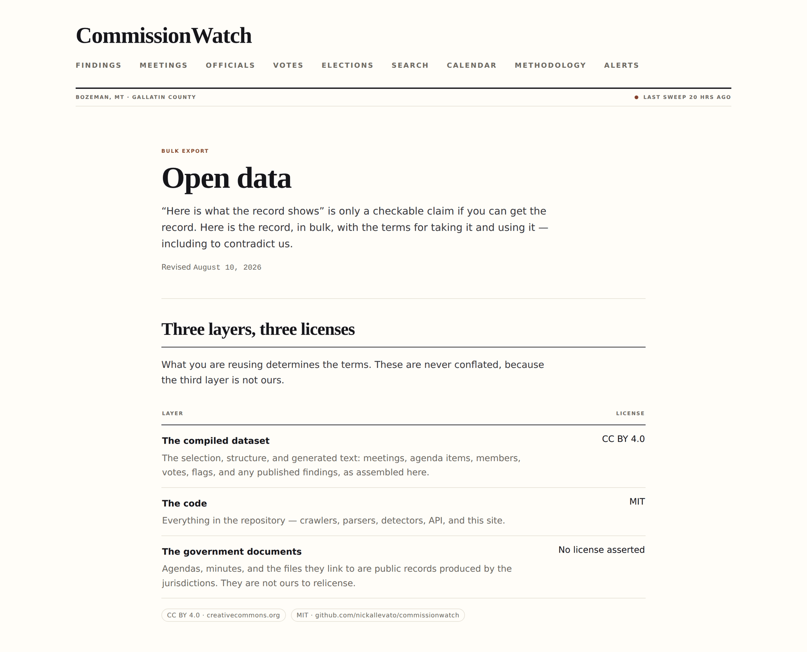

# CommissionWatch

**A public record of what your local government actually did — with the document behind every line of it.**

[](LICENSE)
[](#licence)
[](backend/package.json)
[](SECURITY.md)

CommissionWatch scrapes the agendas, minutes and meeting archives a city or county already
publishes, stores every document by its SHA-256, extracts the meetings, agenda items, officials and
votes out of it, and publishes the result as a searchable site and a bulk open-data export. It has
adapters for the **City of Bozeman** and **Gallatin County, Montana**.

It is a watchdog project, not a government product. Built for citizens watching government; not
sold to government.

**Live:** https://commissionwatch.bmux.sh

[](https://commissionwatch.bmux.sh/meetings/f2181cfb-ab44-4436-b707-7448ccbd5966)

<sub>**A published meeting.** The real 14 July 2026 Bozeman agenda, the stored PDFs it was read
out of, and *Contest this record* on every page. The red line at the top is the site saying what it
does **not** know — this meeting's jurisdiction was never recorded, and a gap gets labelled rather
than quietly filled. [See it live →](https://commissionwatch.bmux.sh/meetings/f2181cfb-ab44-4436-b707-7448ccbd5966)</sub>

### Why it works this way

Anyone can write software that summarises a city council meeting. The hard part is being *believed*
— and being *worth* believing. A summary you cannot check is a rumour with better typography.

So the design starts from the opposite end. Every published sentence traces to a stored document
addressed by its hash, and the hash is in the public export, so you can fetch the same file from the
government yourself and confirm byte for byte that it is the one this project read. Nothing that
names a person is published by software; a human approves it or it stays unpublished. The system is
built to be *audited by strangers*, because on this subject that is the only kind of trust worth
having.

> **Project status — early, and the numbers are public.** The pipeline is real end to end: a live
> Bozeman sweep has run, and minutes extraction produced 44 cited claims from the 2026-07-14
> meeting, every one of them held for operator review. But the published corpus today is **one
> meeting, 36 agenda items, two stored documents, and zero findings** — you can check that yourself
> with the commands below, which is the point. Ingestion on the live deployment is registered and
> **disabled until an operator enables it**; alert delivery is deliberately dormant.
> [`docs/STATUS.md`](docs/STATUS.md) records what is true today, defects included.

---

**Contents** · [What it does](#what-it-does-precisely) · [Invariants](#the-invariants) ·
[Verify a claim yourself](#verify-a-claim-yourself) · [Running it](#running-it) ·
[Your own city](#pointing-it-at-your-own-city) · [The data](#the-data) · [Stack](#stack) ·
[Read next](#where-to-read-next)

---

## What it does, precisely

| | |
|---|---|
| **Collects** | One adapter per source. Politely: one request every 2–10 seconds, never concurrent, an honest user agent naming the project, and a document whose bytes have not changed is never fetched again |
| **Stores** | Every fetched document is content-addressed and kept. Every stage after `fetch` reads a stored artifact, never the live web, so parsing and analysis run at full speed against a source that is blocked or offline |
| **Extracts** | Meetings, agenda items, documents, and per-field extraction confidence. Agenda diffs across republished versions |
| **Flags** | Six meeting detectors — emergency sessions, missing minutes, quorum issues, last-minute agenda changes, unanimous votes on controversial items, closed-door votes. Three more flag types exist for records-derived findings. A flag is a reason to look, never a conclusion |
| **Withholds** | Nothing publishes automatically. A sweep produces a *candidate*; an operator produces a *publication*. Anything naming a person goes to a review queue and stays there until a named human approves it |
| **Publishes** | The site, a full-text search, a public corrections log, a public collection-status page, a meeting calendar with iCal feeds, and a bulk data export under CC BY 4.0 |
| **Refuses** | It does not assert motive, intent, corruption or illegality. It does not score or rank officials. It does not predict votes. It does not transcribe video. It does not accept payment to publish, suppress or prioritise anything |

### The invariants

These are not style preferences. Breaking one is a defect, and each has a test.

- **No unsourced claim reaches the public site.** Every published assertion traces to a stored artifact with a content address.
- **Nothing naming a person auto-publishes.** It goes to the operator review queue.
- **Describe the record, never the motive.** Generated text says what happened, when, and in what order.
- **Failures are disclosed, not swallowed.** Every failure lands in a database row with its error text, and `/status` reads from those rows. A transparency project that silently stops collecting is worse than one that says so.
- **Detection logic applies identically to every entity class.** No detector may filter on entity type to select targets.
- **The database schema is the source of truth for types.**

[](https://commissionwatch.bmux.sh/status)

<sub>**"Failures are disclosed, not swallowed" is a page, not a promise.** `/status` reads every
figure from the ingestion tables at load time — nothing on it is maintained by hand. A source that
is failing says so in red, a source that is switched off says *why* in full, and a source that has
gone quiet past its own expected interval is marked suspect rather than left looking calm.
[See it live →](https://commissionwatch.bmux.sh/status)</sub>

---

## Verify a claim yourself

This is the part that matters, so it goes before the installation instructions. You do not need to
run the project, trust the maintainers, or have an account. You need `curl`.

**1 · Take any published meeting.** Every meeting row carries the content address of the document it
was read out of.

```bash
curl -s https://commissionwatch.bmux.sh/api/data/meetings.json \
  | jq -r '.rows[0] | "\(.date)  \(.status)  \(.id)  \(.source_artifact_sha256)"'
```

**2 · List the documents behind it.** `artifact_references` is the full document-to-artifact
mapping: what was fetched, from where, and the hash of the exact bytes that were parsed.

```bash
curl -s https://commissionwatch.bmux.sh/api/data/artifact_references.json \
  | jq -r --arg m '<meeting_id from step 1>' \
      '.rows[] | select(.meeting_id == $m) | "\(.document_type)\t\(.sha256)\t\(.source_url)"'
```

**3 · Fetch the same file from the government and hash it.**

```bash
curl -sL '<source_url from step 2>' | sha256sum
```

Run on 2026-08-14 against the Bozeman meeting of 2026-07-14, those three steps produce:

```
step 1   2026-07-14  completed  f2181cfb-…  1d60e13b1bee5d68…
step 2   agenda   1d60e13b1bee5d68…  https://granicus_production_attachments.s3.amazonaws.com/bozeman/cce91a0c…html
         minutes  8aa70459462ee7a0…  https://bozeman.granicus.com/DocumentViewer.php?file=bozeman_31abc306…pdf
step 3   1d60e13b1bee5d68b0d750b5eecbe85da68ae3deab650fa247ffbd608dbc51cc  -   ← matches
```

If those hashes match, the document this project parsed is the document the city published — not a
copy, not a paraphrase, the same bytes. If they *do not* match, the city has republished the file
since it was fetched, and the agenda-diff timeline will show you what changed.

That is the whole trust model, and it is deliberately checkable by someone who thinks the project is
wrong. The bytes themselves are **not** redistributed here — they are not this project's documents
to relicense — but the address and the origin are, which is what makes the check possible.

Found something wrong? [The corrections log](https://commissionwatch.bmux.sh/corrections) is public
and [the dispute route](https://commissionwatch.bmux.sh/corrections/dispute) needs no account.
Errors get fixed in the open, with the correction and its cause both on the record.

---

## Running it

Everything below has been executed on a Linux machine with Node 22 and the Docker Compose plugin.

```bash
git clone https://github.com/nickallevato/commissionwatch.git
cd commissionwatch
bash scripts/dev-setup.sh
```

That starts Postgres and MinIO, installs both packages, applies every migration and loads the
demonstration seed. It is idempotent — re-running it is safe. Then, in two terminals:

```bash
cd backend  && npm run dev      # API on http://localhost:3001
cd frontend && npm run dev      # site on http://localhost:3000
```

**Three caveats, because a setup script that lies is worse than one that is manual.** They are
written out in [`CONTRIBUTING.md`](CONTRIBUTING.md#the-one-command-setup-and-its-caveats):

1. The compose stack binds **fixed host ports** — 5432, 9000, 9001. If something already holds one, the container fails to start and the script stops there.
2. `backend/.env` is created but **nothing in the Node process reads it**. There is no `dotenv` dependency. The local defaults live in `backend/knexfile.ts` and `backend/src/services/storage.ts`, and they already match the compose stack.
3. **No ingestion source is enabled.** Setting one up is not the same as pointing it at a county's web server, and the second is a decision a person makes.

### Checks

What CI runs, and what a change has to pass:

```bash
cd backend  && npm run typecheck && npm run lint && npm test
cd frontend && npm run typecheck && npm run lint && npm test -- --run
```

The backend suite needs the database up. It runs against `commissionwatch_test`, which
`scripts/dev-setup.sh` creates.

---

## Pointing it at your own city

The adapter contract is the seam. Adding a jurisdiction means writing one module and adding it to
one array; it does not touch core code, and the contract suite tells you when you are done.

**Read [`docs/ADAPTERS.md`](docs/ADAPTERS.md) before you start.** It has the contract, the two worked
examples, the fixture and `PROVENANCE.md` discipline, the scraping-conduct rules, and — importantly
— the list of things that are **not configuration yet**. Body lists are hardcoded constants in each
adapter, jurisdictions are seeded by migration, and `ingestion_sources.config` is written once at
first boot and never updated. An afternoon is a realistic estimate for a source that publishes a
clean listing page. It is not a config-file exercise.

The honest first step is not code. It is `curl`:

```bash
curl -sS -A 'CommissionWatch/0.1 (civic transparency project; +https://commissionwatch.bmux.sh)' \
  -w 'http=%{http_code} size=%{size_download} final=%{url_effective}\n' \
  -o /dev/null -L 'https://your-city.gov/AgendaCenter'
```

Every significant design change in this project came from a probe, not from reasoning. Bozeman's
real archive was found by following a DNS CNAME chain after HTTP probing dead-ended on an Akamai
wall.

---

## The data

[](https://commissionwatch.bmux.sh/data)

<sub>**"Here is what the record shows" is only a checkable claim if you can get the record.**
[See it live →](https://commissionwatch.bmux.sh/data)</sub>

`/data` describes the dataset, its schema, its licence, how often it changes, and what is withheld
and why. The export is public, unauthenticated, and needs no key:

```bash
curl https://commissionwatch.bmux.sh/api/data                    # the manifest
curl https://commissionwatch.bmux.sh/api/data/meetings.csv       # one table, RFC 4180
curl https://commissionwatch.bmux.sh/api/data/agenda_items.json
```

Ten datasets: `jurisdictions`, `commissions`, `meetings`, `agenda_items`, `meeting_documents`,
`members`, `votes`, `findings`, `artifact_references`, `artifacts`. Every one is available as both
`.json` and `.csv`, and the licence travels with the file in `X-License` and `X-Attribution`
headers, because a downloaded CSV keeps no envelope.

**Only records an operator has published are exported.**
[`/calendar`](https://commissionwatch.bmux.sh/calendar) publishes an iCalendar feed per jurisdiction
at `/api/calendar/{jurisdiction_id}.ics`.

### Licence

Three layers, licensed separately, because they are three different questions.

| Layer | Licence |
|---|---|
| **The compiled dataset** — the selection, structure and generated text | **CC BY 4.0**. Attribute to `CommissionWatch — commissionwatch.bmux.sh` |
| **The code** — everything in this repository | **MIT**, per [`LICENSE`](LICENSE) |
| **The underlying government documents** | Public records. **No licence asserted.** They are not ours, and their bytes are not redistributed here |

The dataset licence covers the compilation, not the facts. That a commissioner voted no on 14 July
is not copyrightable and needs nobody's permission.

---

## Stack

Verify against `package.json` rather than trusting prose — `docs/spec/architecture.md` misstated
this for months.

| Part | Reality |
|---|---|
| Backend | Express 5 + TypeScript, Node 22, Knex migrations |
| Database | PostgreSQL 16 + pgvector |
| Object storage | MinIO (S3-compatible) |
| Frontend | React 19 + Vite + Tailwind (**not** Next.js) |
| Queue | Postgres `SKIP LOCKED` — no Redis |
| Search | PostgreSQL full-text. No vector database, no API key, no per-call cost |
| CI | **Gitea Actions only** — `.gitea/workflows/`. Never add `.github/workflows/`; it does not run here |
| Deploy | Docker Compose behind Caddy, images to ECR, shipped over **SSM Run Command** — never SSH |

```
backend/    Express API, migrations, seeds, ingestion adapters, scheduler
frontend/   React SPA
agents/     Watchdog agent scaffolding
deploy/     Caddy, production compose, the SSM deploy script and its runbook
docs/       Specs, plans, and the adapter authoring guide
scripts/    dev-setup.sh and the database init SQL
```

---

## Where to read next

| | |
|---|---|
| [`docs/STATUS.md`](docs/STATUS.md) | **What is actually true right now** — the live deployment, the gaps, the known defects, the operational traps and the ordered next steps. Read it before starting work. It records what is true, not what was planned |
| [`CONTRIBUTING.md`](CONTRIBUTING.md) | How to work on this: the setup and its caveats, the checks, the review bar, and the rules that are not negotiable |
| [`docs/ADAPTERS.md`](docs/ADAPTERS.md) | Writing an adapter for a new jurisdiction |
| [`SECURITY.md`](SECURITY.md) | Reporting a vulnerability, and the threat model — which here includes publishing without review, not only the usual |
| [`deploy/README.md`](deploy/README.md) | Production deployment, secrets, backups and the restore drill |
| `.claude/skills/commissionwatch-development/SKILL.md` | The development process and the project invariants |

## Contributing

Contributions are welcome, and this is an open-source gift to the world. Open an issue first if the
change is substantial — see [`CONTRIBUTING.md`](CONTRIBUTING.md).

The most useful contribution is not code. It is **an adapter for your own city**, or a correction to
something this project got wrong about your own city. Both are in scope, and the second is the more
important of the two.

## Licence

Code: [MIT](LICENSE). Data: CC BY 4.0. See [the licence table above](#licence).
